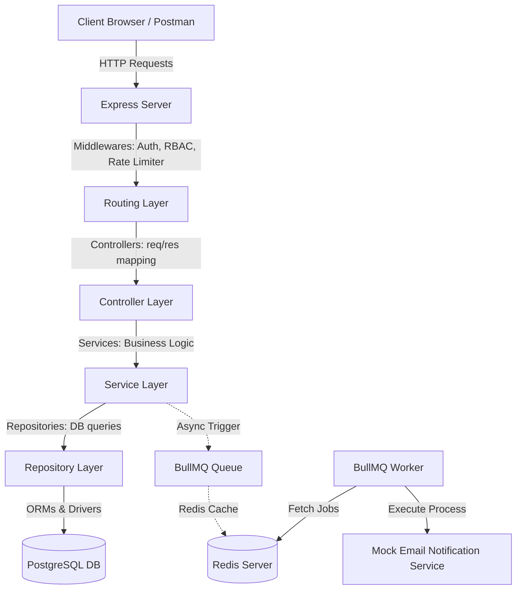
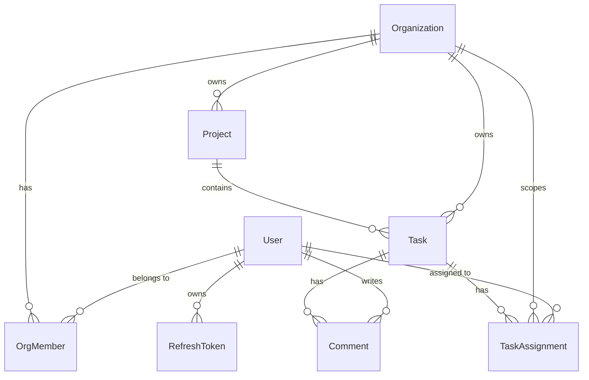

# TaskFlow - Backend System Architecture & Documentation

TaskFlow is a production-ready, lightweight, multi-tenant project management system backend. This application supports multi-tenant isolation, secure Role-Based Access Control (RBAC), robust background job processing with queue retries and rate limiting, database soft-deletes, full-text task searching, and automated testing suites.

*   **Architecture Document:** [ARCHITECTURE.md](file:///d:/work/taskflow/ARCHITECTURE.md)
*   **Published Postman API Documentation:** [TaskFlow Postman API Docs](https://documenter.getpostman.com/view/37496182/2sBYApzYou)

---

## 1. System Architecture Overview

The system follows a clean, decoupled **Layered Architecture (N-Tier)** structure to enforce separation of concerns and maintainability:



### Components:
*   **Routing Layer:** Maps HTTP endpoints, applies validation middlewares (Zod), and handles async routing wrappers.
*   **Controller Layer:** Intercepts request parameters, validates input formats, handles HTTP response structures, and forwards data to services.
*   **Service Layer:** Implements core business rules (e.g., membership verification, permission checks, task calculations).
*   **Repository Layer:** Handles database queries via Prisma ORM. Keeps queries decoupled from business rules.
*   **Background Jobs Pipeline:** Redis-backed BullMQ processing engine running separately from the HTTP request cycle.

---

## 2. Technical Decisions & Trade-offs

During development, several choices were made to optimize security, reliability, and speed:

### A. Dynamic Tenant Scoping
*   **Approach:** All database queries are strictly filtered by the verified tenant ID (`orgId`). The `orgId` is dynamically resolved in the authentication middleware [`auth.middleware.js`](file:///d:/work/taskflow/src/middlewares/auth.middleware.js) by looking up user membership records.
*   **Benefit:** Clients cannot spoof headers or query parameters to access another organization's tasks or projects (preventing information disclosure and cross-tenant leakage).

### B. Session Security & Refresh Token Rotation
*   **Approach:** Standard OAuth 2.0 pattern with HTTP-Only cookies. When an access token expires, the client calls `/auth/refresh` with their refresh token. The backend invalidates the old refresh token and issues a new pair.
*   **Replay Attack Prevention:** If a revoked refresh token is presented, the system triggers a security alert, revokes all active refresh tokens for that user ID, and forces a full re-login on all devices.

### C. Job Deduplication & Rate Limiting
*   **Approach:** Utilizes Redis locks to deduplicate assignment notifications within a 5-second window. If a user is unassigned and reassigned to the same task rapidly, only one email job is enqueued. The BullMQ worker is configured with a native limiter restricting execution to 50 jobs per minute.

---

## 3. Database Modeling



### Key Schema Features:
*   **Enums:** `TaskStatus` (`TODO`, `IN_PROGRESS`, `REVIEW`, `DONE`) and `TaskPriority` (`LOW`, `MEDIUM`, `HIGH`, `URGENT`) are mapped directly to database-native PostgreSQL enums.
*   **Indexes:** Optimized for multi-tenant isolation, query filtering, and sorting (`orgId`, `projectId`, `userId`, `status`, `priority`, and `dueDate`).
*   **Cascades:** Parent deletes cascade to children models (e.g. deleting a task cascades to assignments and comments).

---

## 4. API Documentation & Endpoints

### Documentation Links
*   **Published Postman Collection & Examples:** [TaskFlow Postman API Docs](https://documenter.getpostman.com/view/37496182/2sBYApzYou)
*   **Swagger API Docs:** Available locally at `/docs` (e.g. `http://localhost:5000/docs` or `http://localhost:3000/docs` depending on configuration).

All endpoints are prefix-scoped to `/api/v1`.

### Authentication
*   `POST /auth/register` - Create a new account.
*   `POST /auth/login` - Authenticate credentials, issues HttpOnly cookies, and returns tokens.
*   `POST /auth/refresh` - Rotates refresh tokens and issues new access tokens.
*   `POST /auth/logout` - Revokes the current session refresh token.
*   `POST /auth/logout-all` - Revokes all active refresh tokens for the authenticated user.
*   `GET /auth/me` - Fetch details of the current authenticated user.

### Organizations
*   `POST /organizations` - Create a new organization (tenant).
*   `GET /organizations` - List all organizations the authenticated user belongs to.
*   `GET /organizations/:orgId/members` - Retrieve all registered members within a specific organization (cross-tenant access protected).

### Projects & Tasks (CRUD)
*   `POST /projects` - Create a project.
*   `GET /projects` - List all projects in the organization.
*   `GET /projects/:id` - Fetch project details.
*   `PATCH /projects/:id` - Update a project.
*   `DELETE /projects/:id` - Soft-delete a project (requires `ORG_ADMIN`).
*   `GET /projects/:id/dashboard` - Get status-grouped task counts.
*   `POST /tasks` - Create a task.
*   `GET /tasks` - List/filter tasks (supports full-text search, paging, sorting, status, priority, assignee, and dates).
*   `POST /tasks/:id/assign` - Assign user to a task (sends background notification, deduplicated 5s).
*   `POST /tasks/:id/unassign` - Unassign user.

### Background Jobs
*   `GET /jobs/:id` - Fetch background task execution status (`pending`, `active`, `completed`, `failed`).

---

## 5. Setup & Running Locally

### Environment Prerequisites
Make sure **Node.js (v18+)**, **PostgreSQL**, and **Redis** are running, or use **Docker**.

### Quick Start with Docker (Recommended)
1. Copy the example configuration:
   ```bash
   cp .env.example .env
   ```
2. Build and start containers:
   ```bash
   docker-compose up --build
   ```
This command spins up the API, Worker, PostgreSQL, and Redis instances. It automatically runs migrations and seeds the database.

### Local Setup (Manual)
1. Install dependencies:
   ```bash
   npm install
   ```
2. Set up your `.env` variables (e.g. `DATABASE_URL` pointing to localhost and `REDIS_URL`).
3. Run database migrations:
   ```bash
   npx prisma db push
   ```
4. Seed database:
   ```bash
   npm run db:seed
   ```
5. Run the servers:
   - Run API Server: `npm run dev`
   - Run Worker Process: `npm run worker`

---

## 6. Running Tests

Automated testing is configured using Jest and Supertest.

```bash
# Run unit and integration tests
npm run test
```

Test coverage includes:
- Authentication & register/login flow.
- Token rotation & security compromise invalidation.
- Project & Task CRUD.
- Scoped tenant isolation (cross-tenant access protection checks).
- Background job polling and status routing.
